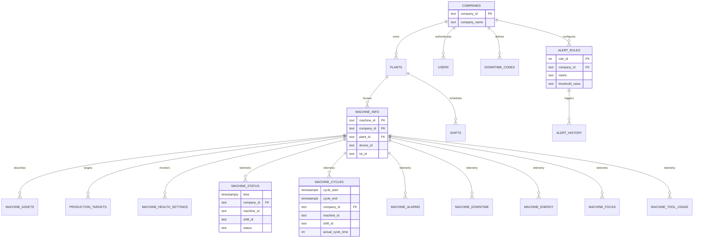

# SETU Data Dictionary (v1.7.0)

- **Version**: 1.7.0
- **Status**: **Active Development**
- **Created**: January 6, 2026
- **Last Updated**: January 9, 2026
- **Architecture**: TimescaleDB (PostgreSQL)
- **Legacy Source**: MSSQL MVP Schema

---

## 1. Executive Summary

This document serves as the **Single Source of Truth** for the SETU Data Platform. It bridges the gap between the legacy MSSQL schema and the new TimescaleDB architecture, documenting valid tables, relationships, and data types.

### Architectural Change Log
> [!IMPORTANT]
> **Shift Logic Change**: In legacy MSSQL, shift logic was calculated at **Read Time** (via `s_GetShiftTime`). In the new architecture, shift logic is resolved at **Write Time** (Ingestion). The `shift_id` is calculated by `bronze.proc_ingest_payload` and persisted into all Silver tables to optimize dashboard aggregation.

---

## 2. Entity Relationship Diagram (ERD)

---

## 3. Legacy Mapping (MSSQL -> TimescaleDB)

| Legacy MSSQL Table | New Postgres Schema.Table | Status | Key Changes |
|:---|:---|:---|:---|
| `MachineRunningStatus_MVP` | `silver.machine_status` | **Implemented** | `UpdatedTS` -> `time`. Added `shift_id` persisted. |
| `MachineWiseCycleDetails_MVP` | `silver.machine_cycles` | **Implemented** | `UpdatedTS` -> `cycle_start`. Added `shift_id`. |
| `MachineWiseDownDetails_MVP` | `silver.machine_downtime` | **Implemented** | `UpdatedTS` -> `down_start`. Added `shift_id`. |
| `MachineWiseAlarmDetails_MVP` | `silver.machine_alarms` | **Implemented** | `UpdatedTS` -> `time`. Added `shift_id`. |
| `MachineWiseEnergyDetails_MVP` | `silver.machine_energy` | **Implemented** | `UpdatedTS` -> `time`. Added `shift_id`. Separated Servo/Spindle. |
| `MachineWiseFocasDetails_MVP` | `silver.machine_focas` | **Implemented** | `UpdatedTS` -> `time`. Added `shift_id`. |
| `MachineWiseToolDetails_MVP` | `silver.machine_tool_usage` | **Implemented** | `UpdatedTS` -> `time`. Added `shift_id`. |
| `MachineWisePMDetails_MVP` | `silver.machine_pm_status` | **Implemented** | `UpdatedTS` -> `time`. Added `shift_id`. |
| `CustomerRatingTransaction_MVP`| `silver.customer_feedback` | **Implemented** | Normalized implementation. |
| `MachineInformation` | `master.machine_info` | **Implemented** | Normalized. `Machine` + `Company` composite key. |
| `Company` | `master.companies` | **Implemented** | - |
| `PlantInformation` | `master.plants` | **Implemented** | - |

---

## 4. Schema Definitions

### 4.1. Bronze Layer (Ingestion)
**Role**: Landing zone. High-volume write throughput.
- **Processing**: `proc_ingest_payload` shreds JSONB into Silver tables and calculates `shift_id`.

| Table | Status | Columns | Description |
|:---|:---|:---|:---|
| `bronze.raw_telemetry` | **Implemented** | `ingest_time` (TS), `device_id`, `iot_id`, `company_id` (FK), `payload` (JSONB), `processed` (BOOL), `batch_id` (UUID) | Raw replication stream. |
| `bronze.migration_metadata`| **Implemented** | `id` (PK), `run_id` (UUID), `table_name`, `rows_migrated`, `min_timestamp`, `max_timestamp`, `company_ids` | Audit trail for migration batches. |
| `bronze.dead_letter_queue` | **Implemented** | `time` (TS), `payload` (JSONB), `error_reason`, `company_id` | Storage for malformed/orphan packets. |

### 4.2. Master Layer (Dimensions)
**Role**: Reference data for joins and filtering.

| Table | Status | PK | Columns | Notes |
|:---|:---|:---|:---|:---|
| `master.companies` | **Implemented** | `company_id` | `company_name`, `effective_from_date` | Root tenant entity. |
| `master.plants` | **Implemented** | `plant_id` | `company_id`, `plant_name`, `plant_city` | Physical locations. |
| `master.machine_info` | **Implemented** | `machine_id, company_id` | `plant_id`, `device_id`, `iot_id` | Core asset registry. |
| `master.machine_assets` | **Implemented** | `asset_id` | `machine_id`, `company_id`, `model_number`, `warranty_expire_date` | Digital twin / Contract data. |
| `master.shifts` | **Implemented** | `shift_id, company_id, plant_id`| `shift_name`, `start_time`, `duration_hrs` | Scheduling logic. |
| `master.production_targets`| **Implemented** | `target_id` | `machine_id`, `company_id`, `shift_id`, `program_no`, `target_parts_per_hour` | OEE denominators. |
| `master.users` | **Implemented** | `user_id, company_id` | `full_name`, `role`, `plant_id` | Auth & Access. |
| `master.downtime_codes` | **Implemented** | `down_id, company_id` | `down_code`, `description`, `category` | Standardization. |

### 4.3. Silver Layer (Enriched Facts)
**Role**: Queryable history. Hypertables.
**Common Columns**: All tables have `company_id`, `machine_id`, and **`shift_id`**.

| Table | Status | Primary Timestamp | Specific Columns | Retention |
|:---|:---|:---|:---|:---|
| `silver.machine_status` | **Implemented** | `time` | `status`, `program_no`, `operator_id`, `target` | 1 Year |
| `silver.machine_cycles` | **Implemented** | `cycle_start` | `cycle_end`, `program_no`, `std_cycle_time`, `actual_cycle_time`, `actual_load_unload`, `std_load_unload`, `down_threshold` | 1 Year |
| `silver.machine_alarms` | **Implemented** | `time` | `alarm_no`, `alarm_desc` | 1 Year |
| `silver.machine_downtime` | **Implemented** | `down_start` | `down_end`, `down_code`, `down_id`, `down_threshold` | 1 Year |
| `silver.machine_energy` | **Implemented** | `time` | `category` (Main/Servo/Spindle), `servo_energy`, `spindle_energy`, `total_energy` | 1 Year |
| `silver.machine_focas` | **Implemented** | `time` | `part_count`, `rej_count`, `pot` (PowerOn), `ot` (Operating), `ct` (Cutting) | 1 Year |
| `silver.machine_tool_usage` | **Implemented** | `time` | `tool_no`, `target_count`, `actual_count` | 1 Year |
| `silver.machine_pm_status` | **Implemented** | `time` | `pm_corrected_count`, `pm_pending_count`, `status` | 2 Years |

### 4.4. Gold Layer (Aggregates)
**Role**: High-speed dashboards. Continuous Aggregates (CAGGs) and Functions.

#### Continuous Aggregates (V017)

| View | Status | Bucket | Source | Aggregations |
|:---|:---|:---|:---|:---|
| `gold.machine_downtime_hourly` | **Implemented** | 1 Hour | `silver.machine_focas` | `total_downtime_seconds` (POT-OT), `total_part_count`, `total_operating_time` |
| `gold.machine_energy_hourly` | **Implemented** | 1 Hour | `silver.machine_energy` | `total_energy_consumption` by category |
| `gold.machine_cycle_stats_hourly` | **Implemented** | 1 Hour | `silver.machine_cycles` | `total_cycles`, `avg_cycle_time`, `total_load_unload_exceeded` |
| `gold.hourly_production_stats` | **Implemented** | 1 Hour | `silver.machine_cycles` | `total_cycles`, `avg_cycle_time`, `avg_std_time` |
| `gold.hourly_downtime_stats` | **Implemented** | 1 Hour | `silver.machine_downtime` | `total_downtime_sec`, `stop_count` |
| `gold.daily_production_stats` | **Implemented** | 1 Day | `gold.hourly...` | Rollup of hourly stats to daily |
| `gold.v_production_dashboard` | **Implemented** | - | `gold.hourly...` | Enriched view with Plant/Machine names |
| `gold.v_oee_dashboard` | **Implemented** | 1 Day | `gold.daily...` | Availability, Performance, Quality metrics |

#### Gold Functions (Reporting API)

| Function | Arguments | Returns | Purpose |
|:---|:---|:---|:---|
| `gold.get_downtime_summary()` | `machine_id`, `company_id`, `start`, `end` | `bucket`, `downtime_seconds`, `part_count` | Downtime analytics for shift/month |
| `gold.get_energy_summary()` | `machine_id`, `company_id`, `start`, `end` | `bucket`, `category`, `total_energy` | Energy consumption by category |
| `gold.get_cycle_summary()` | `machine_id`, `company_id`, `start`, `end` | `bucket`, `total_cycles`, `avg_cycle_time` | Cycle performance analytics |
| `gold.get_home_screen_stats()` | `company_id` | `total`, `running`, `stopped`, `idle` | Live dashboard machine counts |

### 4.5. Config & Alerting
**Role**: Runtime configuration and operational logs.

| Table | Status | PK | columns |
|:---|:---|:---|:---|
| `config.alert_rules` | **Implemented** | `rule_id` | `metric`, `threshold_value`, `condition_operator`, `company_id` |
| `config.alert_subscriptions`| **Implemented** | `subscription_id` | `rule_id`, `user_id`, `method` |
| `alerting.history` | **Implemented** | `alert_id, time` | `rule_id`, `machine_id`, `message`, `status`, `resolved_at` |
| `alerting.active_alerts` | **Implemented** | `company_id, machine_id, rule_id` | `start_time`, `last_checked_at` |

---

## 5. Stored Procedures (Business Logic)

### `bronze.proc_ingest_payload(jsonb, boolean)`
**Core Data Pipeline**:
1.  **Extracts** identifiers (DeviceID, IOTID).
2.  **Resolves** `machine_id`, `company_id`, `plant_id` via lookup.
3.  **Calculates** `shift_id` using `master.get_shift_id(plant, timestamp)`.
4.  **Routes** data to appropriate Silver tables (`machine_status`, `machine_cycles`, etc.) based on JSON keys.
5.  **Persists** `shift_id` into every Silver record for optimizing read-time aggregation.

### `master.get_shift_id(plant_id, timestamp)`
**Shift Resolution**:
- Determines the active shift for a given plant and time.
- Handles cross-day shifts (e.g., Shift C: 10 PM - 6 AM).
