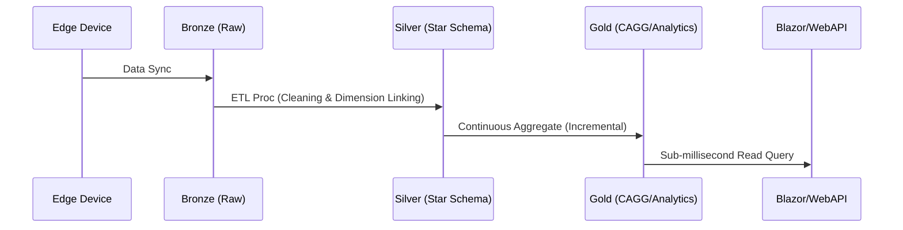

- **Version**: 2.0.0
- **Created**: January 5, 2026
- **Updated**: January 9, 2026
- **Author**: Rahul Shettigar
- **Last Updated By**: Amith B R
- **Description**: High-Level System Design and Data Flow Architecture for SETU - MVP2.
- **Status**: Live

# Project SETU_2: SQL Evolution and Temporal Upgrade
---

## 1. Executive Summary

The project SETU_2 aims to fix minor data modelling isues from  **distributed, time-series optimized architecture** using TimescaleDB. By adopting the **Medallion Architecture** and **Flyway-led Version Control**, we ensure 100% schema traceability. The design enables sub-millisecond query latency for 10k+ machines by decoupling analytical heavy-lifting from front-end serving.

---

## 2. Repository & Version Control Strategy

To ensure AI-assisted development (IDE Agents) and engineers have the context they need, we utilize a **Dual-Core Repository** structure.

```text
/SETU
├── /migrations     <-- Flyway migration scripts (V001-V016, R__)
├── /schema         <-- Schema-specific SQL (Bronze, Silver, Gold, Master, Alerting)
├── /scripts        <-- Utility scripts (Migration & Validation CLI)
├── /ops            <-- Infrastructure (Docker, Setup scripts)
├── /docs           <-- Documentation
```

---

## 3. Data Flow & Medallion Architecture

We utilize a multi-stage refinement process. The core innovation is the **Silver Layer Star Schema**, which acts as the source of truth for the entire business logic.

### **Layer Definitions**

| Layer | Schema Type | Responsibility |
| --- | --- | --- |
| **Bronze** | **Flat / Raw** | Append-only raw dump from Gateway/Edge Devices. No cleaning. |
| **Silver** | **Star Schema** | **The Engine.** Cleaned, deduplicated, and normalized facts (Hypertables) + Dimensions. |custom_andon.v_andon_status_threshold
| **Gold** | **Flat / Agg** | Continuous Aggregates and pre-joined views for specific BI needs. |
| **Master** | **Normalized** | Global reference data (Users, Roles, Sites). |
| **WebApp** | **Flat / Cache** | High-speed serving layer for the .NET/Blazor application. |

---

## 4. System Sequence: Ingestion to Serving

This sequence ensures that raw data is transformed into actionable features without blocking user interactions.



---

## 5. Scalability & High Availability (The 10K Machine Goal)

To support **10,000+ machines** and **5,000+ simultaneous users**, we implement **Read-Only Replication** of the Gold, Masters and WebApp schemas (Only).

* **Workload Separation:** Ingestion and heavy Aggregation happen on the **Primary Writer-Replica**.
* **Zero-Interference Reads:** The Web API hits a **Read-Replica**. This replica *only* contains the required schemas, minimizing memory overhead and maximizing cache hits.
* **Data Lake:** By keeping Bronze as a "Flat Dump," we can easily redirect this stream into an Data Lake (Iceberg/Delta Lake) in the future without changing a single line of ingestion code.

---

## 6. Unified Application Layer (MVC Strategy)

To ensure the Single Source of Truth reaches the user, we unify the controller logic.

* **Shared Controller Logic:** A single C# logic layer serves both **Blazor (Server/WASM)** and **.NET Web API**.
* **Efficiency:** Whether the data is requested via a component or a REST call, the underlying SQL and DTO mapping remain identical.

---